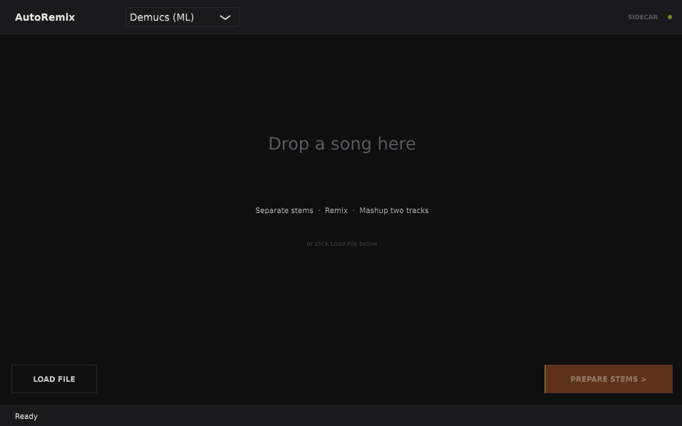
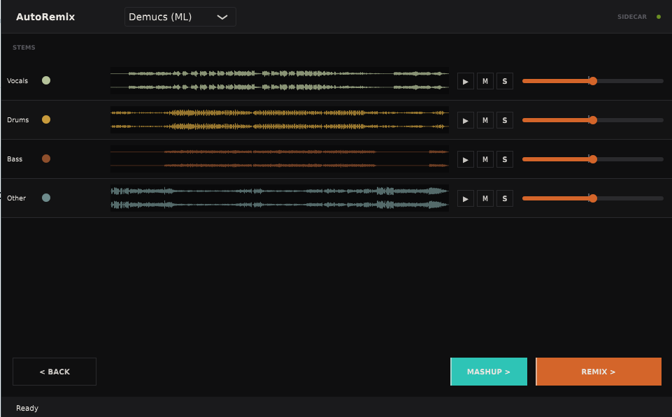
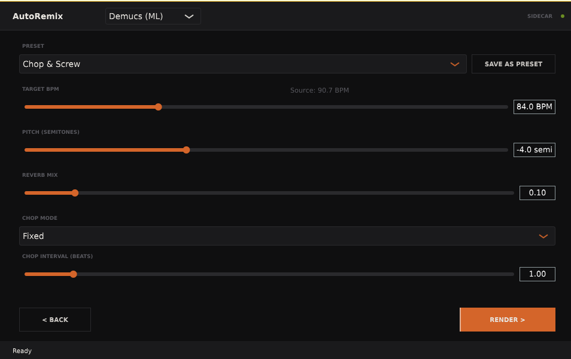
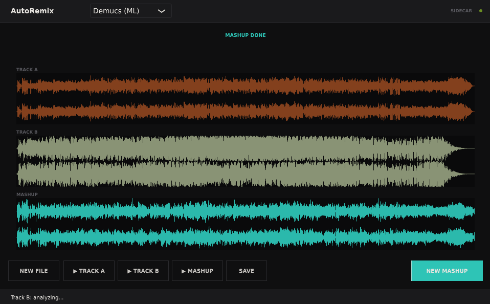
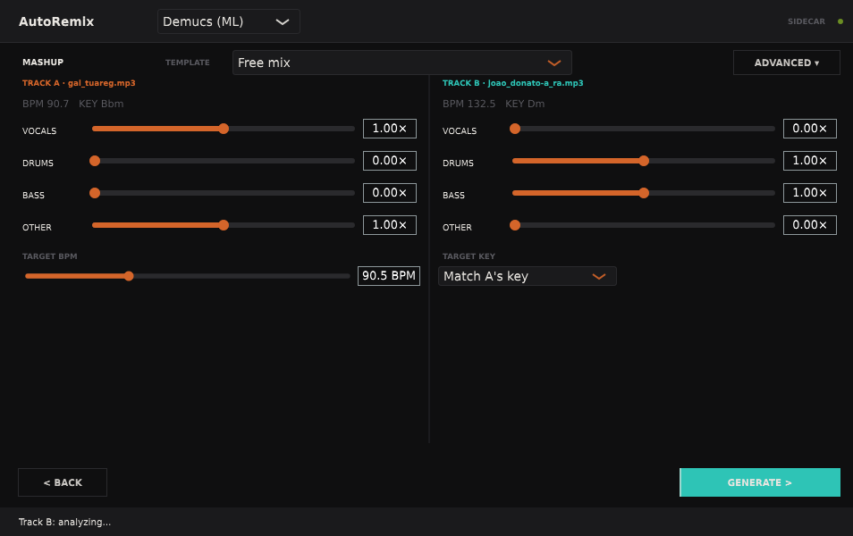

# AutoRemix

> JUCE VST3/AU/Standalone plugin for creative stem-based audio remixing.
> Single-binary install — no external runtime required.

Load any audio file, separate it into stems, tweak per-stem levels and remix parameters, and get a processed output — all inside the plugin. No DAW required for the standalone mode.

Stem separation and remix engines are **pluggable**: new backends register via `SeparatorRegistry` / `RemixRegistry` without touching existing code.

---

## Screenshots

| Screen | Description |
|--------|-------------|
|  | **Step 1 — Drop Zone**: drag a file or browse |
|  | **Step 2 — Separating**: 4-stem extraction in progress |
|  | **Step 3 — Stems Ready**: per-stem playback, mix, and drag-to-DAW |
|  | **Step 4 — Mode & Parameters**: choose style, tune remix settings |
|  | **Step 5 — Render**: waveform comparison, play original vs remix/mashup |
|  | **Step 6 — Mashup**: combine 2 tracks, two-column 8-stem mixer, 8 built-in templates |

> **Note:** Screenshots not yet captured. Run the standalone app and record your own.

---

## Quick Start

**Linux / macOS**

```bash
# 1. Clone
git clone --recurse-submodules https://github.com/dobidu/autoremix.git
cd autoremix

# 2. Build plugin
cmake -B build -G Ninja -DCMAKE_BUILD_TYPE=Release
cmake --build build --parallel

# 3. Launch standalone
./build/plugin/AutoRemix_artefacts/Release/Standalone/AutoRemix
```

**Windows**

```bat
:: 1. Clone
git clone --recurse-submodules https://github.com/dobidu/autoremix.git
cd autoremix

:: 2. Build plugin
cmake -B build -DCMAKE_BUILD_TYPE=Release
cmake --build build --config Release --parallel

:: 3. Launch standalone
build\plugin\AutoRemix_artefacts\Release\Standalone\AutoRemix.exe
```

---

## Complete Tutorial

### Prerequisites

- Plugin built and launched (standalone or loaded in DAW as VST3/AU)
- Audio file ready (WAV, AIFF, FLAC, MP3, OGG, M4A)

### The Interface

The plugin window is **960 × 600 px**. It has three persistent zones and a central area that changes per screen:

```
┌─────────────────────────────────────────────────────────────────────────────────────┐
│  AutoRemix   [Algorithmic FFT ▼]                                              MODEL │  ← header
├─────────────────────────────────────────────────────────────────────────────────────┤
│                                                                                     │
│                         [ current screen content ]                                  │
│                                                                                     │
├─────────────────────────────────────────────────────────────────────────────────────┤
│  Ready                                                                              │  ← status bar
└─────────────────────────────────────────────────────────────────────────────────────┘
```

- **Separator combo** (header): choose stem separator before processing
- **MODEL indicator** (top-right): shows Demucs model download status when using ML separation
- **Status bar** (footer): shows current operation and messages

---

### Step 1 — Load a File

**Screen: Empty (Drop Zone)**

```
┌─────────────────────────────────────────────────────────────────────────────────────┐
│  AutoRemix   [Algorithmic FFT ▼]                                              MODEL │
├─────────────────────────────────────────────────────────────────────────────────────┤
│                                                                                     │
│                                                                                     │
│                        Drop an audio file here                                      │
│                             — or —                                                  │
│                           [ Browse... ]                                             │
│                                                                                     │
│                                                                                     │
├─────────────────────────────────────────────────────────────────────────────────────┤
│  Ready                                                                              │
└─────────────────────────────────────────────────────────────────────────────────────┘
```

> `[SCREENSHOT: 01-empty.png — drop zone with drag-drop hint and Browse button]`

**How to load a file:**

- **Drag and drop**: drag any supported audio file onto the plugin window
- **Browse**: click the Browse button to open a file picker

Supported formats: `.wav`, `.aif`, `.aiff`, `.mp3`, `.flac`, `.ogg`, `.m4a`

After loading, the plugin analyses the file (BPM detection, key detection) and shows a waveform preview:

```
┌─────────────────────────────────────────────────────────────────────────────────────┐
│  AutoRemix   [Algorithmic FFT ▼]                                              MODEL │
├─────────────────────────────────────────────────────────────────────────────────────┤
│                                                                                     │
│   ▒▒▒▓▓▒░░▒▒▓▒░▒▒▓▓░▒▒▒▒▓▓▒░░▒▒▓▒░▒▒▓▓░▒▒▒▒▓▓▒░░▒▒▓▒░▒▒▓▓░                          │
│                                                                                     │
│   detected: 128 BPM  ·  A minor                                                     │
│                                                                                     │
│                   [ Separate Stems ]       [ Change File ]                          │
│                                                                                     │
├─────────────────────────────────────────────────────────────────────────────────────┤
│  Analyzed: 128.0 BPM, A minor                                                       │
└─────────────────────────────────────────────────────────────────────────────────────┘
```

> `[SCREENSHOT: 01b-empty-loaded.png — waveform visible, BPM and key displayed, Separate Stems button]`

**Before separating**, choose your stem separator in the header combo:
- **Algorithmic FFT** — fast, always available, rough stems (band-split)
- **Demucs (ML)** — professional-quality isolation using the htdemucs neural network. On first use, the plugin automatically downloads the htdemucs model (~353 MB). Subsequent launches use the cached model from your app data directory.

Click **Separate Stems** to proceed.

---

### Step 2 — Stem Separation

**Screen: Separating**

```
┌─────────────────────────────────────────────────────────────────────────────────────┐
│  AutoRemix   [Algorithmic FFT ▼]                                              MODEL │
├─────────────────────────────────────────────────────────────────────────────────────┤
│                          SEPARATING                                                 │
│                                                                                     │
│   Vocals  ████████████████████░░░░░░░░░░░░░░░░░░░   done                            │
│   Drums   ████████████████████████████░░░░░░░░░░░░   done                           │
│   Bass    ██████████░░░░░░░░░░░░░░░░░░░░░░░░░░░░░░   processing...                  │
│   Other   ░░░░░░░░░░░░░░░░░░░░░░░░░░░░░░░░░░░░░░░░   waiting                        │
│                                                                                     │
│                         12 s                                                        │
├─────────────────────────────────────────────────────────────────────────────────────┤
│  Separating stems...                                                                │
└─────────────────────────────────────────────────────────────────────────────────────┘
```

> `[SCREENSHOT: 02-separating.png — 4 stem progress rows with elapsed time counter]`

The plugin runs the selected separator natively. Algorithmic FFT is instant; Demucs ML inference may take 30–120 s on CPU. Progress is shown per-stem with an elapsed timer. This screen navigates automatically to Stems Ready when complete.

---

### Step 3 — Stems Ready

**Screen: Stems Ready**

```
┌─────────────────────────────────────────────────────────────────────────────────────┐
│  AutoRemix   [Algorithmic FFT ▼]                                              MODEL │
├─────────────────────────────────────────────────────────────────────────────────────┤
│  STEMS                                                                              │
│                                                                                     │
│  ● Vocals  ▒▒▓▓▒░▒░░░▒▒▒▓▒▒▒░░▒▒▒▒▒▓▓▒░░▒▒░   ▶  M  S  ──────●────── 1.0           │
│  ● Drums   ▒░▒░▒░▒░▒░▒░▒░▒░▒░▒░▒░▒░▒░▒░▒░▒░   ▶  M  S  ──────●────── 1.0           │
│  ● Bass    ▓▓░░░░▓▓░░░░▓▓░░░░▓▓░░░░▓▓░░░░▓▓   ▶  M  S  ──────●────── 1.0           │
│  ● Other   ░▒▓▒░▓▒░▓▒░▓▒░░▒░░░▒░░▒▒░░▒░░░▒░   ▶  M  S  ──────●────── 1.0           │
│                                                                                     │
│  [ < Back ]                                              [ Choose Style > ]         │
├─────────────────────────────────────────────────────────────────────────────────────┤
│  Stems ready. Play, adjust mix, then choose a remix style.                          │
└─────────────────────────────────────────────────────────────────────────────────────┘
```

> `[SCREENSHOT: 03-stems-ready.png — 4 stem rows with waveforms, play/mute/solo controls, gain sliders]`

**Controls per stem row:**

| Control | Action |
|---------|--------|
| `▶` / `■` | Play / stop this stem. Multiple stems can play simultaneously. A white cursor moves over the waveform while playing. |
| `M` (Mute) | Silence this stem in the remix output |
| `S` (Solo) | Mute all other stems |
| Slider (0–2×) | Per-stem gain applied to the remix output (0 = silent, 1 = unity, 2 = double) |

**Drag to DAW**: drag any stem row out of the plugin window to export the raw stem WAV file directly to a DAW track or file manager.

When satisfied with the stem balance, click **Choose Style →** to proceed.

---

### Step 4 — Mode & Parameters

**Screen: Mode Params**

```
┌─────────────────────────────────────────────────────────────────────────────────────┐
│  AutoRemix   [Algorithmic FFT ▼]                                              MODEL │
├─────────────────────────────────────────────────────────────────────────────────────┤
│  STYLE                                                                              │
│  [ Chop & Screw ▼──────────────────────────────────────── ] [ Save as Preset ]      │
│                                                                                     │
│  PARAMETERS                                                                         │
│  Target BPM   ──────────●─────────────  89.6  BPM                                   │
│  Pitch Shift  ──●───────────────────── −4.0   semi                                  │
│  Reverb Mix   ──────●───────────────── 0.05                                         │
│  Chop Mode    [ Beat-Aligned ▼]                                                     │
│  Chop Beats   ────────●────────────────  2.0  beats                                 │
│                                                                                     │
│  [ < Back ]                                                  [ Remix → ]            │
├─────────────────────────────────────────────────────────────────────────────────────┤
│  Detected: 128.0 BPM → target 89.6 BPM                                              │
└─────────────────────────────────────────────────────────────────────────────────────┘
```

> `[SCREENSHOT: 04-mode-params.png — preset combo, parameter sliders, chop mode combo, Save as Preset button]`

**Style preset combo** — choose from 9 built-in styles or any user presets:

| Preset | Engine | Character |
|--------|--------|-----------|
| Chop & Screw | chopped_screwed | 0.7× tempo, −4 semi pitch |
| Slowed Reverb | slowed_reverb | 0.75× tempo, heavy reverb |
| Drum & Bass | drum_and_bass | 2× drums, bass boost |
| Trap Stutter | effect chain | beat-chop vocals, onset drums |
| Onset Drill | effect chain | onset vocal chop, energy gate |
| Structural Loop | effect chain | structural reorder + reverb |
| Phonk | effect chain | 0.88×, −3 semi, bass boost |
| Jersey Club | effect chain | 1.25× drums, tight vocal chops |
| Nightcore | effect chain | 1.30×, +4 semi |

**Parameters:**

| Parameter | Range | Description |
|-----------|-------|-------------|
| Target BPM | 40–200 | Output tempo. Defaults from preset. Detected source BPM shown in status bar. |
| Pitch Shift | −24 to +24 semi | Pitch shift in semitones |
| Reverb Mix | 0–1 | Wet/dry reverb blend |
| Chop Mode | 6 options | How effect-chain presets cut the audio (see table below) |
| Chop Beats | 0.25–16 | Chop interval in beats (active for Fixed and Beat-Aligned modes) |

**Chop Mode options** (effect-chain presets only):

| Mode | Description |
|------|-------------|
| Fixed (ms) | Fixed-interval chop in milliseconds |
| Beat-Aligned | Cuts at beat positions |
| Onset-Triggered | Cuts at transient onsets (drum hits, note attacks) |
| Bar-Locked | Cuts every N beats (default 4 = one bar) |
| Energy Gate | Silences low-energy regions below threshold |
| Structural | Reorders structural segments (verse/chorus-level) |

**Save as Preset**: enter a name → saves to `~/.config/autoremix/modes/` (Linux/macOS) or `%APPDATA%\autoremix\modes\` (Windows). Appears in the combo immediately.

Click **Remix →** to start rendering.

---

### Step 5 — Render & Compare

**Screen: Render — in progress**

```
┌─────────────────────────────────────────────────────────────────────────────────────┐
│  AutoRemix   [Algorithmic FFT ▼]                                              MODEL │
├─────────────────────────────────────────────────────────────────────────────────────┤
│                           RENDERING...                                              │
│                              42 s                                                   │
│  ████████████████████████████████░░░░░░░░░░░░░░░░░░░░░░░░░░░░░░░░░░░░░             │
│                                                                                     │
│                           [ Cancel ]                                                │
├─────────────────────────────────────────────────────────────────────────────────────┤
│  Remixing...                                                                        │
└─────────────────────────────────────────────────────────────────────────────────────┘
```

> `[SCREENSHOT: 05a-rendering.png — progress bar and elapsed timer while remix runs]`

A Cancel button aborts and returns to Mode Params.

**Screen: Render — done**

```
┌─────────────────────────────────────────────────────────────────────────────────────┐
│  AutoRemix   [Algorithmic FFT ▼]                                              MODEL │
├─────────────────────────────────────────────────────────────────────────────────────┤
│  DONE                                                                               │
│                                                                                     │
│  ORIGINAL ─────────────────────────────────────────────────────────────────────     │
│  ▒▒▓▓▒░▒░░░▒▒▒▓▒▒▒░░▒▒▒▒▒▓▓▒░░▒▒░▒░░░▒▒▒▓▒▒▒░░▒▒▒▒▒▓▓▒░░▒▒▒▒▓▓▒░▒░░░▒▒▒             │
│                                                                                     │
│  REMIX ──────────────────────────────────────────────────────────────────────────   │
│  ▓▒░▒░░░▒▒▒▓▒▒▒░░▒▒▒▒▒▓▓▒░░▒▒░▒░░░▒▒░▒▒▒▒░▒▒▒▓▒▒░░▒▒▒▒▒▒░▒░░░▒▒▒▒▓▓▒░▒░░░▒▒         │
│                                                                                     │
│  [ New File ]  [ ▶ Original ]  [ ▶ Remix ]  [ Save ]          [ New Remix ]        │
├─────────────────────────────────────────────────────────────────────────────────────┤
│  Done. Output: /tmp/autoremix/output/track_remix.wav                                │
└─────────────────────────────────────────────────────────────────────────────────────┘
```

> `[SCREENSHOT: 05b-done.png — DONE state with two stacked waveforms and action buttons]`

**Comparing Original vs Remix:**

- **▶ Original** — plays the source file through the plugin. A white cursor moves across the Original waveform while playing. Click again to stop.
- **▶ Remix** — plays the rendered remix. A white cursor moves across the Remix waveform. Switching between Original/Remix stops the other automatically.

**Other actions:**

| Button | Action |
|--------|--------|
| Save | Save remix WAV to a location you choose |
| New Remix | Return to Mode Params and adjust settings |
| New File | Start over with a new audio file |

---

### Step 6 — Mashup (combine two tracks)

Pair two tracks into a single coherent remix. AutoRemix reuses the same
stem-separation, BPM detection, key detection, and time-stretch +
pitch-shift infrastructure to align track B to track A automatically.

**Entry point**: from **ScreenStemsReady** (after track A is separated),
click the **[MASHUP >]** footer button (teal). The orange **[REMIX >]**
button continues to the single-track remix flow — the two are independent.

A file picker opens for track B. After picking, the status bar reports
`Track B: analyzing... → Track B: separating...` and you land on the
mashup screen.

**Screen: Mashup**

```
┌─────────────────────────────────────────────────────────────────────────────────────┐
│  AutoRemix   [Algorithmic FFT ▼]                                              MODEL │
├─────────────────────────────────────────────────────────────────────────────────────┤
│  MASHUP   TEMPLATE [ Vocal Acapella ▼ ]                          [ Advanced ▾ ]    │
│                                                                                     │
│  TRACK A | track_a.wav        │  TRACK B | track_b.wav                              │
│  BPM 128.0  KEY Am            │  BPM 96.0   KEY C                                   │
│  ─────────────────────────────┼─────────────────────────────                       │
│  VOCALS   ──────────●────── 1.0  │  VOCALS  ●─────────────── 0.0                    │
│  DRUMS    ●──────────────── 0.0  │  DRUMS   ──────────●───── 1.0                    │
│  BASS     ●──────────────── 0.0  │  BASS    ──────────●───── 1.0                    │
│  OTHER    ●──────────────── 0.0  │  OTHER   ──────────●───── 1.0                    │
│                                                                                     │
│  TARGET BPM  ──●──────────  128.0    TARGET KEY  [ Anchor to A ▼]                  │
│                                                                                     │
│  [ < Back ]                                              [ Generate > ]            │
├─────────────────────────────────────────────────────────────────────────────────────┤
│  Track B ready                                                                      │
└─────────────────────────────────────────────────────────────────────────────────────┘
```

> `[SCREENSHOT: 06-mashup.png — two-column 8-stem mixer with TEMPLATE combo and Advanced ▾]`

**The two-column mixer**: 8 volume sliders total — one per stem per track.
Slide to 0 for silence, 1 for unity, 2 for +6 dB. The mashup output is the
sum of all 8 weighted stems, LUFS-normalized.

**Templates** (one-click presets): the TEMPLATE combo populates every
slider and the Advanced section. 8 built-ins ship with AutoRemix:

| Template | Description |
|----------|-------------|
| Vocal Acapella | A's voice over B's instrumental — classic mashup |
| Drum Swap | A's track with B's drums replacing A's |
| Slowed Mashup | Both tracks slowed (0.75×) + heavy reverb + −2 semi |
| Nightcore Mashup | Both tracks sped up (1.30×) and pitched up (+4 semi) |
| Dub Echo | A's vocals swimming over B's drums + bass + heavy reverb |
| Instrumental Layer | A's instrumentals layered with B's pads + drums |
| Bass Swap | A's track with B's bass line replacing A's |
| Frankenstein | Balanced split: A vox + other, B drums + bass |

Custom user templates: drop your own JSON files in `~/.config/autoremix/mashup/`
(Linux/macOS) or `%APPDATA%\autoremix\mashup\` (Windows). User mashup templates
are loaded at startup alongside the 8 built-in templates.

**Advanced ▾ (5 feel knobs)**: click to reveal extra sliders for finer
sonic control. All five start at no-op defaults, so collapsed = same as
the simple mixer.

| Knob | Range | Effect |
|------|-------|--------|
| Tempo Mod | 0.5–1.5× | Multiplier on top of the anchored BPM. 0.75 = slowed, 1.3 = nightcore |
| Master Pitch | −12 to +12 semi | Extra pitch shift on the final mix, on top of key matching |
| Reverb Mix | 0–1 | Master reverb wet level |
| Reverb Room | 0–1 | Master reverb room size |
| HPF Track B | 0–400 Hz | High-pass filter on track B before mixing — solves the "two bass lines clashing" problem in layered mashups |

**Auto-alignment**: when you click **Generate >**, AutoRemix:
1. Separates both tracks (if not already cached for this session)
2. Detects A and B's BPM + key independently
3. Time-stretches track B to match `target_bpm × tempo_modifier` (clamp 0.5–2.0)
4. Pitch-shifts track B by the shortest semitone path to `target_key`
5. Applies per-stem gains for both tracks
6. Sums all 8 weighted stems, truncating to the shorter track
7. Applies master pitch + reverb if non-zero
8. LUFS-normalizes and writes the output WAV

A rendering screen with elapsed seconds appears while the engine works
(can take 15–120 s depending on separator choice and track length). Result
lands on the ScreenRender Done state, where you can play the mashup, save
it, or return to start a new one.

---

## Requirements

### Linux
- CMake ≥ 3.22, Ninja
- GCC 12+ or Clang 14+ (C++20)
- `libasound2-dev libfreetype6-dev libfontconfig1-dev libx11-dev libxinerama-dev libxcursor-dev libxrandr-dev libgl1-mesa-dev libcurl4-openssl-dev`

### macOS
- Xcode 14+ (Command Line Tools sufficient)
- CMake ≥ 3.22, Ninja (`brew install cmake ninja`)

### Windows
- Visual Studio 2022 with C++ workload
- CMake ≥ 3.22 (included with VS or from cmake.org)
- No extra system libs required

---

## Build

### Linux / macOS

```bash
git clone --recurse-submodules https://github.com/dobidu/autoremix.git
cd autoremix
cmake -B build -G Ninja -DCMAKE_BUILD_TYPE=Release
cmake --build build --parallel
```

**Artifacts:**
```
build/plugin/AutoRemix_artefacts/Release/Standalone/AutoRemix          # Linux
build/plugin/AutoRemix_artefacts/Release/Standalone/AutoRemix.app      # macOS
build/plugin/AutoRemix_artefacts/Release/VST3/AutoRemix.vst3/
build/plugin/AutoRemix_artefacts/Release/AU/AutoRemix.component/       # macOS only
```

### Windows

```bat
git clone --recurse-submodules https://github.com/dobidu/autoremix.git
cd autoremix
cmake -B build -DCMAKE_BUILD_TYPE=Release
cmake --build build --config Release --parallel
```

**Artifacts:**
```
build\plugin\AutoRemix_artefacts\Release\Standalone\AutoRemix.exe
build\plugin\AutoRemix_artefacts\Release\VST3\AutoRemix.vst3\
```

---

## Stem Separators

| ID | Method | Quality | Speed |
|----|--------|---------|-------|
| `algorithmic` | FFT band-split (native IIR) | Low (leaky, bleeding) | Instant |
| `demucs` | htdemucs ONNX via ORT 1.17.0 | High (clean isolation) | ~30–120 s CPU |

**Demucs model download**: on first use, the plugin downloads `htdemucs.onnx`
(~353 MB) and caches it in your app data directory:
- Linux: `~/.config/autoremix/models/htdemucs.onnx`
- macOS: `~/Library/Application Support/autoremix/models/htdemucs.onnx`
- Windows: `%APPDATA%\autoremix\models\htdemucs.onnx`

Subsequent launches skip the download. No manual installation needed.

---

## Remix Engines & Presets

### Built-in Engine Presets

| Preset | Engine | Character |
|--------|--------|-----------|
| Chop & Screw | chopped_screwed | 0.7× tempo, −4 semi pitch, chop every 2 s |
| Slowed Reverb | slowed_reverb | 0.75× tempo, algorithmic reverb |
| Drum & Bass | drum_and_bass | 2× drums, bass boost +6 dB |

### Built-in Effect-Chain Presets

| Preset | Style | Key ops |
|--------|-------|---------|
| Trap Stutter | Trap | beat-chop vocals ×3, onset drums ×2, +8 dB bass |
| Onset Drill | Drill | onset vocal chop, energy gate other, beat bass |
| Structural Loop | Experimental | structural reorder + reverb + 0.85× stretch |
| Phonk | Phonk | 0.88×, −3 semi, +8 dB bass, dark reverb |
| Jersey Club | Jersey Club | 1.25× drums/bass, tight onset vocal chops ×3 |
| Nightcore | Nightcore | 1.30× all, +4 semi (vocals + other only) |

---

## Custom Presets

Presets are JSON files. Drop them in `~/.config/autoremix/modes/` (Linux/macOS) or `%APPDATA%\autoremix\modes\` (Windows). User presets are loaded at startup alongside the 9 built-in presets.

**Engine-based preset (v1.0):**
```json
{
  "id": "my_style",
  "version": "1.0",
  "name": "My Style",
  "engine": "chopped_screwed",
  "params": {
    "tempo_factor": 0.80, "pitch_shift_semi": -2.0,
    "reverb_mix": 0.20, "chop_interval_ms": 1500.0,
    "bass_boost_db": 0.0, "drums_tempo_factor": 1.0
  },
  "stem_mix": { "vocals": 1.0, "drums": 1.0, "bass": 1.0, "other": 1.0 },
  "effects": []
}
```

**Effect-chain preset (v2.0):**
```json
{
  "id": "my_chain",
  "version": "2.0",
  "name": "My Chain",
  "params": { "tempo_factor": 0.75, "pitch_shift_semi": -2.0, "reverb_mix": 0.1,
              "chop_interval_ms": 0.0, "bass_boost_db": 0.0, "drums_tempo_factor": 1.0 },
  "stem_mix": { "vocals": 1.0, "drums": 1.0, "bass": 1.2, "other": 0.8 },
  "effects": [
    { "op": "time_stretch", "stems": "all",    "params": { "factor": 0.75 } },
    { "op": "reverb",       "stems": "all",    "params": { "mix": 0.20, "room_size": 0.7 } },
    { "op": "bass_boost",   "stems": ["bass"], "params": { "db": 6.0 } }
  ]
}
```

**Available effect ops:**

| Op | Key param(s) | Description |
|----|-------------|-------------|
| `time_stretch` | `factor` (0.1–4.0) | Tempo scaling (<1 = slower) |
| `pitch_shift` | `semitones` (−24–24) | Pitch change |
| `reverb` | `mix`, `room_size` | Algorithmic reverb |
| `chop` | `interval_ms` | Fixed-interval chop |
| `bass_boost` | `db` | Low-shelf boost/cut |
| `eq_highpass` | `cutoff_hz` | High-pass filter |
| `chop_beats` | `division`, `repeat` | Beat-aligned chop |
| `chop_onsets` | `min_gap_ms`, `threshold`, `repeat` | Onset-triggered chop |
| `chop_bars` | `beats_per_bar`, `repeat` | Bar-aligned chop |
| `gate_energy` | `threshold_db`, `hold_ms` | Energy gate |
| `structural_cut` | `n_segments`, `mode` | Structural segment reorder |

`stems` accepts `"all"`, a single name, or a list: `["bass", "drums"]`.

---

## Architecture

```
┌────────────────────────────────────────────────────────────────────────┐
│  AutoRemix — Native C++ Plugin (JUCE 7, C++20)                         │
│                                                                        │
│  PluginProcessor                                                        │
│  ├─ NativeAnalysis        (BPM, key, LUFS — juce::dsp)                 │
│  ├─ NativeAlgorithmicSeparator  (4-band IIR cascade)                   │
│  ├─ NativeDemucsSeparator       (htdemucs ONNX, ORT 1.17.0)           │
│  │   └─ ModelDownloader   (DOD + SHA256 + retry × 3)                   │
│  ├─ NativeRemixEngines    (ChoppedAndScrewed, SlowedReverb, DnB)       │
│  ├─ NativeEffectChainEngine  (11-op DSL interpreter)                   │
│  ├─ NativeMashupEngine    (BPM/key align + per-stem RubberBand)        │
│  ├─ NativePresetLoaders   (binary-embedded JSONs + user dir override)  │
│  ├─ TimePitchStretcher    (RubberBand offline)                         │
│  └─ MixerAudioSource (StemPlayer[4] + preview transport)              │
│                                                                        │
│  PluginEditor (6-screen flow)                                          │
│  ├─ ScreenEmpty → ScreenSeparating → ScreenStemsReady                  │
│  ├─ ScreenModeParams → ScreenRender                                    │
│  └─ ScreenMashup                                                       │
└────────────────────────────────────────────────────────────────────────┘
```

All processing is native C++. No HTTP IPC, no child processes.

**Pluggability:** implement `IStemSeparator` or `IRemixEngine`, register in the respective registry — no changes to existing code.

---

## Known Limitations

- Algorithmic FFT separator: rough stems (band-split only). Use Demucs for production.
- No real-time processing — offline batch only.
- Demucs ML: native ONNX inference via ORT 1.17.0 (CPU only). ~30–120 s per track on CPU. GPU (CUDA/DirectML) deferred to v4.1.
- AU format (macOS): not code-signed — requires user to manually allow in System Settings > Privacy & Security on macOS 13+.
- Linux: `libcurl4-openssl-dev` required at runtime for the Demucs model download.

---

## License

GPL-3.0. See [LICENSE](LICENSE).
